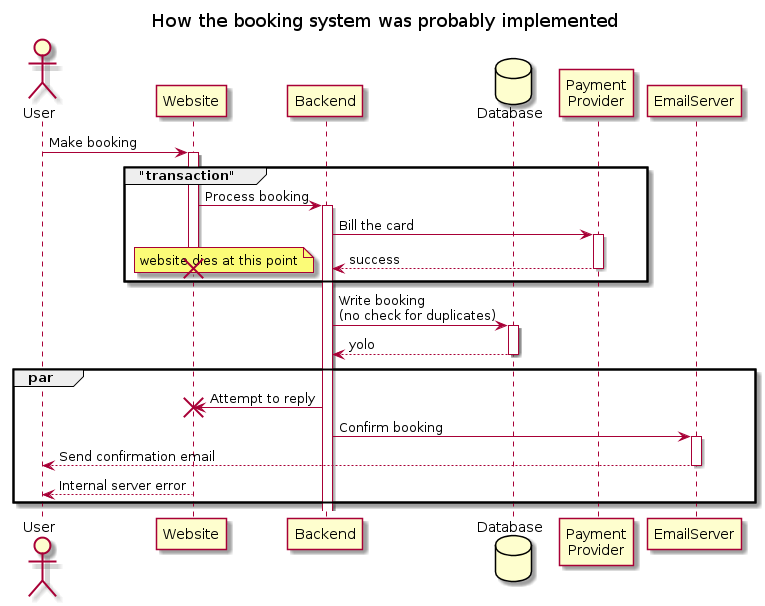
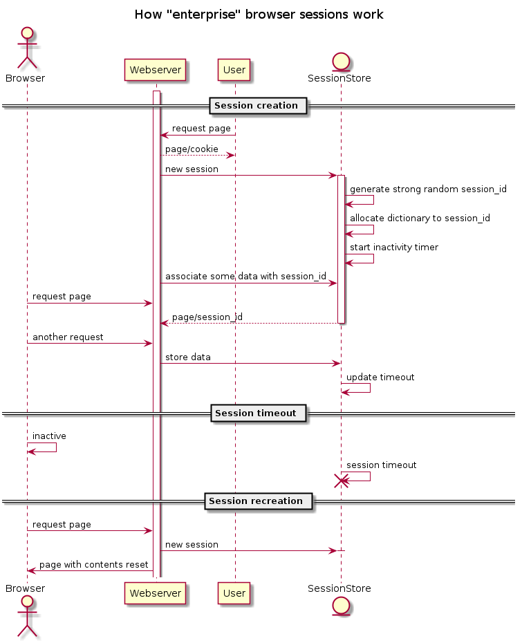
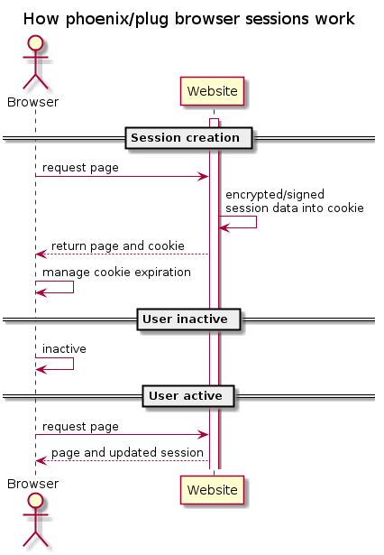

theme: Simple, 1
autoscale: true
slidenumbers: true
footer: © Erlang Solutions 2020

# [fit] Customer retention 
# [fit] and how to avoid double billing
Bryan Hunt (ESL)


---

About me

* Slinging code for 20 years [^brag_list] 
* Writing Elixir for about 5 years now (and loving it)
* Widely regarded as having a bad attitude
* Make 52 slides so we'll have to move fast
* Stop me if I curse, can't help it, I'm Irish

[^brag_list]: Perl, VB, C, C++, PHP, Python, Java, Scala, Javascript, Actionscript, Erlang, Shell, Ansible, Zsh, AWK, Sed, etc, 😴


---

# Why I like Elixir

* Elixir has lovely syntax and UX  💃
* Elixir makes hard things easy ✅ 
* Elixir also makes easy things easy ✅ 
* Elixir lacks drama ✅  
* Elixir is stable/boring ✅
* Elixir doesn't just crash 〽 [^stg] and burn 🔥


[^stg]: Unlike the £
^ elixir is boring

---


# Talk objectives

1. Global platform to rant about Aer Lingus having double charging me.
2. An analyis of why their system double charged me.
3. Illustrate techniques to :
  * Build a more reliable system 
  * Not double charge customers
  * Be aware of problems

---


# Opening scene [^never forgive/never forget/never for fun]

1. Emergency! I need to fly from Dublin to London early tomorrow morning. 
2. The website warns me there are only 3 seats remaining for the flight. 
3. I select flight, don't care which seat, and enter my credit card details (after dealing with a couple of session timeouts).
4. The Aer Lingus website: 
  * Insists I sign up for their loyalty scheme (the sweet, sweet irony).
  * Crashes.
  * Locks me out.
5. I wait 30 minutes and don't receive any email confirmation
6. Panic 😧

[^never forgive/never forget/never for fun]: This happened nearly 4 years ago but I still want my £95.99 back (with interest)

---

# A desperate fool


1. Fresh browser.
2. Start the booking process from scratch.
3. Decline the Aer Lingus loyalty scheme 😱.
4. Use the same name, email, and credit card.
5. On the second attempt, the booking succeeded.
6. Nervously await booking confirmation.

---

# Success ! 


Receive a booking confirmation at 8:03 PM - I will fly to London! [^rain_and_horrible_food]

[^rain_and_horrible_food]: Where it's almost certainly raining, and £10 for a pizza which an Italian would use to wipe the floor.

---


# Actually, fail !

* Another booking confirmation, this time at 8:15 PM..
* Check my bank account - billed twice.
* Activate the online chat - it times out 
* Call the website helpdesk... no answer.. 
* Maybe I'm not the only one having issues

---


# Good luck with that ! 

> I can guarantee there's nobody listening on either of these two numbers
-- Me

[.column]

> Website Helpdesk 
> 0333 006 6920 
> Mon-Fri 
> 08:00-06:00 
> Sat-Sun & Bank Holidays: 
> 09:00-06:00     

[.column]

> Reservations 
> 0333 004 5000 
> Mon-Fri: 
> 08:00-6:00 
> Sat-Sun & Bank Holidays: 
> 09:00-06:00

---

# Aftermath 

* Whine about Aer Lingus on social media/Linkedin
* Ponder what went wrong 
* Could I implement a better system in Elixir? [^spoilers]


[^spoilers]: HTTP header leakage reveals it's running on Java/JBOSS - so of course we can.. 

---

# What could we improve? 

1. Error detection/notification 
2. Fault tolerance
3. Session storage 
5. Prevent double billing 

^Error detection - the customer shouldn't have to chase a system error.  
^Tolerate failure - improve reliability of network calls (database/microservices).  
^Session storage - Handle more customers (sessions) at once with fewer physical resources.
^Session storage - Allow a user session to live longer (5 minute timeout are too short).
^Prevent double billing - Prevent duplicate writes to a relational database.
^Prevent double billing - Prevent duplicate writes to anything.

---


---




---

# Error detection/notification

* Add [bugsnag-elixir](https://github.com/jarednorman/bugsnag-elixir) as a dependency and sign up for the bugsnag software as a service (GDPR?).
* Connect [WombatOAM](https://www.erlang-solutions.com/products/wombatoam.html) to the node [^disclosure] and use it to detect errors.
* Write your own global error handler...

[^disclosure]: ESL product

---

# Global error handler implementation

---

```elixir
defmodule Global.Handler do
  require Logger
  @behaviour :gen_event

  def init([]), do: {:ok, []}

  def handle_call({:configure, new_keys}, _state) do
    {:ok, :ok, new_keys}
  end

  def handle_event({:error_report, gl, {_pid, _type, [message | _]}}, state)
      when is_list(message) and node(gl) == node() do
      Logger.error("Global error handler: #{inspect(message, pretty: true)}")
      #Or maybe use the new (elixir 1.10.1) structured logger?
    {:ok, state}
  end

  def handle_event({_level, _gl, _event}, state) do
    {:ok, state}
  end
end

```

^ Rather than `Logger.error` - do something useful? Your choice.

----

## Using the global error handler

Add it :

```
  :error_logger.add_report_handler(Global.Handler)
```

Trap exit signals

```
  Process.flag(:trap_exit,true)
```

Spawn at process which will raise an exception/terminate

```
  Task.async(fn -> raise "hell" end)
```


^ Trap exit signals (don't kill iex):

---

# Fault tolerance

Lets concentrate on handling calls to another system which is temporarily failing.

We need an intelligent way to retry failed operations 

* Code your own retry handling logic? 
* Luke! Use the (open) source! 

Options: 

* [safwank/ElixirRetry](https://github.com/safwank/ElixirRetry)
* [IanLuites/with_retry](https://github.com/IanLuites/with_retry)

^Retry is more recently updated and I'm currently using it on a project, so we'll use it for this example

---

Using Retry library ([safwank/ElixirRetry](https://github.com/safwank/ElixirRetry))


```elixir
use Retry
retry with: exponential_backoff(1000,2) |> 
  jitter() |> 
  Enum.take(5) do
  countdown = Process.get(:countdown,0)   
  IO.puts("counter: #{countdown}, #{DateTime.utc_now}" )
  if countdown < 4 do
    Process.put(:countdown, countdown + 1)
    raise "countdown too low - trying again..."
  else 
    :ok
  end
  after
    result -> result
  else
    error -> error
end
```


^ Ships with various backoff options - exponential, linear, can also be configured to only handle certain exceptions. 
^ recognises tuple starting with :error as an error (can't be overriden but you can configure it to recognise other atoms as well


---

Quick shout out to the Elixir macro overlords [^java (™)]


```
cat retry4j/src/**/*.java | wc -l 
    3178
```

```
cat deps/retry/lib/**/*.ex | wc -l 
     464
```

[^java (™)]: And I'm so grateful not to be coding Java...

^The thing is, implementing something like this in Elixir is very easy


----

# Session storage 

> "Your session has timed out after 5 minutes of inactivity, please start again and wade through the 20 screens the marketing "people" insisted on adding to the booking flow..."
-- Every Java/.Net website ever


^Ever notice how when the session times out - airline websites always set the travel dates to two weeks in the future - don't they know what cookies are for? 
---

# We need to talk about session storage

Issues : 

* [Memory constraints](https://stackoverflow.com/questions/11956038/what-happens-to-a-java-web-containers-memory-when-there-are-too-many-concurrent) 
* Restart the server - lose all sessions
* Horizontal scaling 

^ Every session is stored in memory (webserver or some distributed system)
^Store the session data in a datastore

---

# Session storage in Plug/Phoenix

---



---



---

# How do we configure session storage in Phoenix/Plug

`endpoint.ex`

```elixir
plug Plug.Session,
  store: :cookie,
  key: "_chat_key",
  signing_salt: "cKjB7sPT"
  max_age: 24*60*60*30  # 30 days
```

> Trivial

^The Plug.Sessions module has a built-in option to set the expiration of a cookie using the max_age key. For example, extending your endpoint.ex snippet would look like:
^The session content can also be encrypted 


---

# Prevent double billing

---

# Unique database constraints 

---

# Ecto (Elixir persistence framework)

Basic concepts 

* Migration
* Changeset
* Repo 
* Conveniences

^ Schema - where you define the database structure
^ Changeset - represents changes - you feed this into the Ecto.Repo
^ Repo - provides functions for storing and retrieving data

----


### Migration

[.column]
```elixir
defmodule Airline.Repo.Migrations.CreateFlightBookings do
  use Ecto.Migration

  def change do
    create table(:flight_bookings) do
      add :name, :string
      add :surname, :string
      add :cc_hash, :string
      add :flight_number, :string
      add :minute, :string
      add :hour, :string
      add :day, :string
      add :month, :string
      add :year, :string

      timestamps()
    end
.....
```
[.column]
```elixir
    create unique_index(
             :flight_bookings,
             [:name,
              :surname,
              :cc_hash,
              :flight_number,
              :minute,
              :hour,
              :day,
              :month,
              :year ],
             name: :unique_traveller_index)
  end
end
```

^ we hash the cc to prevent fraud 

---

### Changeset

[.column]
```elixir
defmodule Airline.Flight.Booking do
  use Ecto.Schema
  import Ecto.Changeset

  schema "flight_bookings" do
    field :cc_hash, :string
    field :day, :string
    field :flight_number, :string
    field :hour, :string
    field :minute, :string
    field :month, :string
    field :name, :string
    field :surname, :string
    field :year, :string

    timestamps()
  end
```
[.column]
```elixir
  @doc false
  def changeset(booking, %{} = attrs) do
    booking |> cast(attrs,[ 
                    :name,
                    :surname,
                    :cc_hash,
                    :flight_number,
                    :minute,
                    :hour,
                    :day,
                    :month,
                    :year ])
    |> validate_required([ 
                    :name,
                    :surname,
                    :cc_hash,
                    :flight_number,
                    :minute,
                    :hour,
                    :day,
                    :month,
                    :year])
    |>  unique_constraint(:unique_booking_constraint, 
name: :unique_traveller_index)
  end

end
```

^ cast - Applies the given params as changes for the given data according to the given set of permitted keys. Returns a changeset.
^ validate required - ensures required values are set
^ unique constraint - The unique constraint works by relying on the database to check 
^ if the unique constraint has been violated or not and, if so, Ecto converts it into a changeset error.
^ naive implementation - indexes are not free - they slow up writes


---

# Repo

> A repository maps to an underlying data store, controlled by the adapter. For example, Ecto ships with a Postgres adapter that stores data into a PostgreSQL database.

---

# Convenience 

[.column]
Generated most of the prior code with the following command:

[.column]
```bash
mix phx.gen.schema \
  Booking \
  flight_bookings \
  name \
  surname \
  cc_hash \
  flight_number \
  minute \
  hour \
  day \
  month \
  year 
```

---

Using the Ecto changeset for validation without using the database

```
iex(8)> Airline.Flight.Booking.changeset(%Airline.Flight.Booking{}, %{})                                                            
#Ecto.Changeset<
  action: nil,
  changes: %{},
  errors: [
    name: {"can't be blank", [validation: :required]},
    surname: {"can't be blank", [validation: :required]},
    cc_hash: {"can't be blank", [validation: :required]},
    pp_hash: {"can't be blank", [validation: :required]},
    flight_number: {"can't be blank", [validation: :required]},
    minute: {"can't be blank", [validation: :required]},
    hour: {"can't be blank", [validation: :required]},
    day: {"can't be blank", [validation: :required]},
    month: {"can't be blank", [validation: :required]},
    year: {"can't be blank", [validation: :required]}
  ],
  data: #Airline.Flight.Booking<>,
  valid?: false
>
```

---

Generate a validated changeset


```
cc_num_hash = :crypto.hash(:sha256,"5105105105105100") |> Base.encode64
 

input = %{
  name: "davey",
  surname: "jones",
  cc_hash: cc_num_hash,
  flight_number: "flight_number",
  minute: "minute",
  hour: "hour",
  day: "day",
  month: "month",
  year: "year"
}

valid_changeset = %Ecto.Changeset{valid?: true} = Airline.Flight.Booking.changeset(%Airline.Flight.Booking{}, input)

```

---

Insert unique data 

```
iex(7)> Airline.Repo.insert(valid_changeset)                                                                             
[debug] QUERY OK db=3.4ms decode=1.4ms queue=2.2ms idle=9906.6ms
INSERT INTO "flight_bookings" ("cc_hash","day", SNIP...
{:ok,
 %Airline.Flight.Booking{
   __meta__: #Ecto.Schema.Metadata<:loaded, "flight_bookings">,
   cc_hash: "cc_hash",
   day: "day",
   flight_number: "flight_number",
   hour: "hour",
   id: 1,
   inserted_at: ~N[2020-02-28 22:20:54],
   minute: "minute",
   month: "month",
   name: "name",
   surname: "surname",
   updated_at: ~N[2020-02-28 22:20:54],
   year: "year"
 }}
```

---

Insert duplicate data

```
iex(8)> Airline.Repo.insert(valid_changeset)

[debug] QUERY ERROR db=7.4ms queue=1.9ms idle=9324.1ms
INSERT INTO "flight_bookings" ("cc_hash","day", SNIP...
{:error,
 #Ecto.Changeset<
   action: :insert,
   changes: %{
     cc_hash: "cc_hash",
     day: "day",
     flight_number: "flight_number",
     hour: "hour",
     minute: "minute",
     month: "month",
     name: "name",
     surname: "surname",
     year: "year"
   },
   errors: [
     unique_booking_constraint: {"has already been taken", [constraint: :unique, constraint_name: "unique_traveller_index"]}
   ],
   data: #Airline.Flight.Booking<>,
   valid?: false
 >}

```

^ That was useful - we seem to be relatively safe - but that's 9 database indexes - things are going to get slow

---

# Lets try something a little more efficient 


^ we don't necessarily want random access to all of those columns but we do want to prevent duplicates.
^ we could generate a checksum in the changeset function and make it unique instead.

---

We add an `:entity_hash` column to the Booking module 


[.column]

```elixir
defmodule Airline.Flight.Booking do
  use Ecto.Schema
  import Ecto.Changeset

  @required_attrs [ :name, :surname, :cc_hash, :entity_hash, :flight_number, :minute, :hour, :day, :month, :year ]

  @hash_attrs @required_attrs

  schema "flight_bookings" do
    field :cc_hash, :string
    field :entity_hash, :string
    field :day, :string
    field :flight_number, :string
    field :hour, :string
    field :minute, :string
    field :month, :string
    field :name, :string
    field :surname, :string
    field :year, :string

    timestamps()
  end

```

---

And modify the changeset function to calculate the hash of the unique fields before we store a booking to the database

```elixir
  @doc false
  def changeset(booking, %{} = attrs) do
    entity_hash =
      :crypto.hash(:sha256, inspect(Map.to_list(attrs |> Map.take(@hash_attrs))))
      |> Base.encode64()

    augmented_attrs = Map.put(attrs, :entity_hash, entity_hash)

    booking
    |> cast(
      augmented_attrs,
      @required_attrs
    )
    |> validate_required(@required_attrs)
    |> unique_constraint(:unique_booking_constraint, name: :unique_traveller_index)
  end
end

```
---

The schema/migration now becomes the much more reasonable 

```elixir
defmodule Airline.Repo.Migrations.CreateFlightBookings do
  use Ecto.Migration

  def change do
    create table(:flight_bookings) do
      add :name, :string
      add :surname, :string
      add :cc_hash, :string
      add :entity_hash, :string
      add :flight_number, :string
      add :minute, :string
      add :hour, :string
      add :day, :string
      add :month, :string
      add :year, :string
      timestamps()
    end

    create unique_index( :flight_bookings, [ :entity_hash ], name: :unique_traveller_index)
  end
end
```

^ Audience challenge - compare the relative insert performance for a table with 10 indexed columns VS 1

---


---

# Can we be even more efficient?

> Can we know if a booking has already passed through the system without touching the database?

---

# Bloom filter [^bloom]

Used as an optimization in many data stores to avoid searching/index lookup when the entity just doesn't exist.

* Cassandra 
* Riak 


[^bloom]: A Bloom filter is a space-efficient probabilistic data structure, conceived by Burton Howard Bloom in 1970, that is used to test whether an element is a member of a set [https://en.wikipedia.org/wiki/Bloom_filter](https://en.wikipedia.org/wiki/Bloom_filter) 

^Used in Riak/Cassandra to check if a file definitely doesn't contain a record
^A bloom filter can tell if something definitely is not present (has NOT been seen)
^It cannot tell if something has been seen/exists
^Typically used in Sorted String Table datastores to avoid searching for objects in files

---

Using a bloom filter ([gmcabrita/bloomex](https://github.com/gmcabrita/bloomex))

[.column]

```elixir
defmodule Bloomer do
 use GenServer

  def start_link(_) do
    GenServer.start_link(__MODULE__, nil, name: __MODULE__)
  end

  def add(element) do
    GenServer.cast( __MODULE__, {:add, element})
  end

  def exists(element) do
    GenServer.call( __MODULE__, {:exists, element})
  end
```
[.column]

```elixir
  @impl true
  def init(_) do
    {:ok, Bloomex.scalable(1000, 0.1, 0.1, 2) }
  end

  @impl true
  def handle_call({:exists,element} , _from, state) do
    exists = Bloomex.member?(state, element)
    {:reply, exists, state}
  end

  @impl true
  def handle_cast({:add, element}, state) do
    {:noreply, Bloomex.add(state, element) }
  end
end
```

---

Add the GenServer to the supervison tree of your application module


```elixir
defmodule Airline.Application do
  # See https://hexdocs.pm/elixir/Application.html
  # for more information on OTP Applications
  @moduledoc false

  use Application

  def start(_type, _args) do
    # List all child processes to be supervised
    children = [
      Bloomer,
      Airline.Repo
```
---


---

# Add the bloom filter into the storage module 


```elixir
changeset = Airline.Flight.Booking.changeset(%Airline.Flight.Booking{}, booking)
if Bloomer.exists {:booking, changeset.changes.entity_hash}  do
  Logger.warn("Possible duplicate booking #{inspect(booking)}")
end
Bloomer.add {:booking, changeset.changes.entity_hash}
```

^So if something unusual was happening... the logfiles would indicate a problem
^Slight issue - bloom filter is local to the node so if user is sending work though another node it won't be picked up 
^Single point of failure - so use it as an indicator - and remember - it can only tell you if something has definitely NOT already been seen 

---

# What about the database being down? 

^ how can we handle intermittend database failures on the critical path?

---

Remember Retry? 

We can use Retry to retry database inserts 

```

defmodule Bookings do

  import Ecto.Query, warn: false
  alias Airline.Repo
  alias Airline.Flight.Booking

  def insert_booking_with_retry( %{ name:_, surname:_, cc_hash:_, flight_number:_, minute:_, hour:_, day:_, month:_, year:_ } = booking) do
    use Retry

    retry with: exponential_backoff()  |> Enum.take(10) , rescue_only: [DBConnection.ConnectionError]   do
      IO.puts("attempting to insert changeset - #{DateTime.utc_now}")
      changeset = Airline.Flight.Booking.changeset(%Airline.Flight.Booking{}, booking)
      case Repo.insert(changeset) do
        {:error, changeset = %{valid?: false}  } -> {:invalid_changeset, changeset }
        other -> other
      end
    after
      result -> result
    else
      error -> error
    end
  end
end
```

---

demo


---

# What could we improve? 

1. Error detection/notification ✅  
2. Fault tolerance ✅
3. Session storage ✅
5. Prevent double billing ✅

---

# Thanks for listening!

Slide (markdown) content can be found at

[`https://github.com/esl/bryan_cb_sf_2020_talk`](git@github.com:esl/bryan_cb_sf_2020_talk.git)

Thank you to :
* Erlang team
* Elixir team
* The open source community
* Erlang solutions for flying me out to sunny USA


