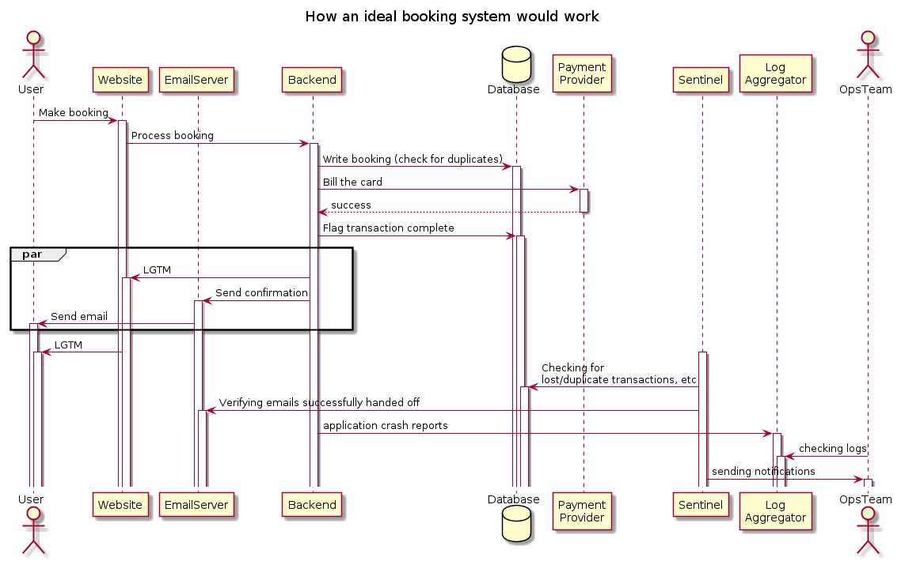
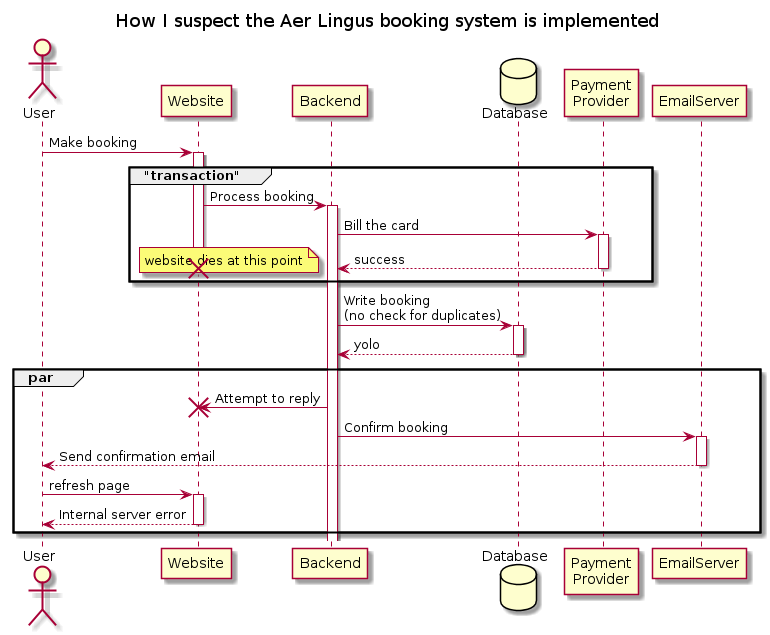
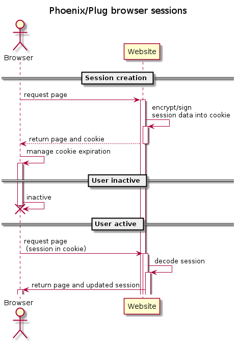

theme: Simple, 1
autoscale: true
slidenumbers: true
footer: © Erlang Solutions 2020

# [fit] Customer retention 
# [fit] and how to avoid double billing
Bryan Hunt (ESL)


---

* Slinging code for 20 years [^list] 
* Writing Elixir for about 5 years now 
* Elixir is my favorite language ever
* Elixir doesn't just make the hard things possible 
* Elixir makes the hard things easy
* Elixir lacks drama 
* Elixir is boring

[^list]: Perl, VB, C, C++, PHP, Python, Java, Scala, Javascript, Actionscript, Erlang, Shell, Ansible, Zsh, AWK, Sed, etc, etc .... yawn


^ elixir is boring

---


# Talk overview


1. To rant about Aer Lingus in front of a live audience...
2. A superficial analysis of what may have gone wrong.
3. How to build better functionality using Elixir and Postgres [^*]

[^*]: Or something resembling Postgres...

---


# Opening scene [^never forget]

1. Needed to fly within the next 14 hours between Dublin and London.
2. The website warned me there were only 3 seats remaining for the flight. 
3. I booked and entered credit card details (after dealing with a couple of session timeouts)
4. The website crashed and locked me out after trying to sign me up for their loyalty scheme (the irony)
5. Waited 30 minutes (no email confirmation)... 
6. Panic 😧

[^never forget]: Happened nearly 4 years ago but I still want my £95.99 back

---

# Desperation


1. Fresh browser
2. Start the booking process
3. Decline the Aer Lingus loyalty scheme 😱
4. Use the same name, email, and credit card.
5. On the second attempt, the booking succeeded.
6. Fingers crossed...


---

# Success ! 


Receive a booking confirmation at 8:03 PM - the flight is booked !

---


# Actually, fail !

* Another booking confirmation, this time at 8:15 PM..
* Check the bank account - charged twice.

---

* Contact the online chat.. leave the window open for 40 minutes, nobody answers.
* Call the website helpdesk... no answer.. maybe I'm not the only one having issues.

> Website Helpdesk
> 0333 006 6920
> Mon-Fri 08:00-06:00
> Sat-Sun & Bank Holidays: 09:00-06:00     
> 
> Reservations
> 0333 004 5000
> Mon-Fri 08:00-6:00
> Sat-Sun & Bank Holidays: 09:00-06:00     

---

# Aftermath 

* Sporadically harass Aer Lingus on social media/Linkedin
* Ponder how such a thing is possible
* If I had to do implement something similar would Elixir make it any easier?

----




----





---

# So how can we do better? 

1. Capture all crashes and do something useful with them
2. Prevent duplicate billing
3. Gracefully handle (temporary) resource unavailability
3. Reduce RAM and make horizontal scaling possible by not storing user sessions in RAM
4. Reduce crashes in general with OTP 
5. Use a distributed/replicated database
6. Make the customers happy 
8. `$$$` Profit `$$$`

---

# Capture all crashes and do something useful with them

* Add [bugsnag-elixir](https://github.com/jarednorman/bugsnag-elixir) as a dependency and sign up for the bugsnag service.
* Connect [WombatOAM](https://www.erlang-solutions.com/products/wombatoam.html) to the node [^disclosure]
* Write your own global error handler...

[^disclosure]: ESL product

---

# Capture crashes across all BEAM processes


```elixir
defmodule Global.Logger do
  require Logger
  @behaviour :gen_event

  def init([]), do: {:ok, []}

  def handle_call({:configure, new_keys}, _state) do
    {:ok, :ok, new_keys}
  end

  def handle_event({:error_report, gl, {_pid, _type, [message | _]}}, state)
      when is_list(message) and node(gl) == node() do
      Logger.error("Global error handler: #{inspect(message, pretty: true)}")
    {:ok, state}
  end

  def handle_event({_level, _gl, _event}, state) do
    {:ok, state}
  end
end

```

----

# Installing/Running the error handler


```
:error_logger.add_report_handler(Global.Logger)
```

```
Process.flag(:trap_exit,true)
```

```
Task.async(fn -> raise "hell" end)
```

Rather than `Logger.error` - do something useful.

Or maybe just send it to the console and let a k8s event handler pick it up.

Your choice.


---

# Handling a task that fails 

Code your own retry handling logic or use one that already exists


Options: 

* [safwank/ElixirRetry](https://github.com/safwank/ElixirRetry)

* [IanLuites/with_retry](https://github.com/IanLuites/with_retry)


^Retry is more recently updated and I'm currently using it on a project, so we'll use it for this example

---


Using Retry library ([safwank/ElixirRetry](https://github.com/safwank/ElixirRetry))


[.column]


```elixir
use Retry
retry with: linear_backoff(500, 1) |> Enum.take(5) do
  countdown = Process.get(:countdown,0)   
  IO.puts("counter: #{countdown}, #{DateTime.utc_now}" )
  if countdown < 3 do
    Process.put(:countdown, countdown + 1)
    raise "countdown too low - trying again..."
  else 
    :ok
  end
  after
    result -> result
  else
    error -> error
end
```

[.column]


```
counter: 0, 2020-02-29 09:54:11.935722Z
counter: 1, 2020-02-29 09:54:12.436910Z
counter: 2, 2020-02-29 09:54:12.939001Z
counter: 3, 2020-02-29 09:54:13.441907Z
```

^ Ships with various backoff options - exponential, linear, can also be configured to only handle certain exceptions. 
^ recognises tuple starting with :error as an error (can't be overriden but you can configure it to recognise other atoms as well

----

# Implementing unique constraints 

---

### Schema

```elixir
defmodule Chat.Repo.Migrations.CreateFlightBookings do
  use Ecto.Migration

  def change do
    create table(:flight_bookings) do
      add :name, :string
      add :surname, :string
      add :cc_hash, :string
      add :flight_number, :string
      add :minute, :string
      add :hour, :string
      add :day, :string
      add :month, :string
      add :year, :string

      timestamps()
    end

    create unique_index(
             :flight_bookings,
             [ :name, :surname, :cc_hash, :flight_number, :minute, :hour, :day, :month, :year ],
             name: :unique_traveller_index
           )
  end
end
```

^ we hash the cc to prevent fraud 

---

### Module

```elixir
defmodule Chat.Flight.Booking do
  use Ecto.Schema
  import Ecto.Changeset

  schema "flight_bookings" do
    field :cc_hash, :string
    field :day, :string
    field :flight_number, :string
    field :hour, :string
    field :minute, :string
    field :month, :string
    field :name, :string
    field :surname, :string
    field :year, :string

    timestamps()
  end

  @doc false
  def changeset(booking, attrs) do
    booking
    |> cast(attrs, [ :name, :surname, :cc_hash,  :flight_number, :minute, :hour, :day, :month, :year ])
    |> validate_required([ :name, :surname, :cc_hash,  :flight_number, :minute, :hour, :day, :month, :year ])
    |>  unique_constraint(:unique_booking_constraint, name: :unique_traveller_index)
  end

end
```

^ cast - Applies the given params as changes for the given data according to the given set of permitted keys. Returns a changeset.
^ validate required - ensures required values are set
^ unique constraint - The unique constraint works by relying on the database to check 
^ if the unique constraint has been violated or not and, if so, Ecto converts it into a changeset error.
^ naive implementation - indexes are not free - they slow up writes

---

Using the Ecto changeset for validation without using the database

```
iex(8)> Chat.Flight.Booking.changeset(%Chat.Flight.Booking{}, %{})                                                            
#Ecto.Changeset<
  action: nil,
  changes: %{},
  errors: [
    name: {"can't be blank", [validation: :required]},
    surname: {"can't be blank", [validation: :required]},
    cc_hash: {"can't be blank", [validation: :required]},
    pp_hash: {"can't be blank", [validation: :required]},
    flight_number: {"can't be blank", [validation: :required]},
    minute: {"can't be blank", [validation: :required]},
    hour: {"can't be blank", [validation: :required]},
    day: {"can't be blank", [validation: :required]},
    month: {"can't be blank", [validation: :required]},
    year: {"can't be blank", [validation: :required]}
  ],
  data: #Chat.Flight.Booking<>,
  valid?: false
>
```

---

Generate a validated changeset


```
cc_num_hash = :crypto.hash(:sha256,"5105105105105100") |> Base.encode64
pp_num_hash = :crypto.hash(:sha256,"970478931") |> Base.encode64
 

input = %{
  name: "davey",
  surname: "jones",
  cc_hash: cc_num_hash,
  flight_number: "flight_number",
  minute: "minute",
  hour: "hour",
  day: "day",
  month: "month",
  year: "year"
}

valid_changeset = %Ecto.Changeset{valid?: true} = Chat.Flight.Booking.changeset(%Chat.Flight.Booking{}, input)

```

---

Insert fresh data 

```
iex(7)> Chat.Repo.insert(valid_changeset)                                                                             
[debug] QUERY OK db=3.4ms decode=1.4ms queue=2.2ms idle=9906.6ms
INSERT INTO "flight_bookings" ("cc_hash","day", SNIP...
{:ok,
 %Chat.Flight.Booking{
   __meta__: #Ecto.Schema.Metadata<:loaded, "flight_bookings">,
   cc_hash: "cc_hash",
   day: "day",
   flight_number: "flight_number",
   hour: "hour",
   id: 1,
   inserted_at: ~N[2020-02-28 22:20:54],
   minute: "minute",
   month: "month",
   name: "name",
   surname: "surname",
   updated_at: ~N[2020-02-28 22:20:54],
   year: "year"
 }}
```

---

Insert stale data

```
iex(8)> Chat.Repo.insert(valid_changeset)

[debug] QUERY ERROR db=7.4ms queue=1.9ms idle=9324.1ms
INSERT INTO "flight_bookings" ("cc_hash","day", SNIP...
{:error,
 #Ecto.Changeset<
   action: :insert,
   changes: %{
     cc_hash: "cc_hash",
     day: "day",
     flight_number: "flight_number",
     hour: "hour",
     minute: "minute",
     month: "month",
     name: "name",
     surname: "surname",
     year: "year"
   },
   errors: [
     unique_booking_constraint: {"has already been taken", [constraint: :unique, constraint_name: "unique_traveller_index"]}
   ],
   data: #Chat.Flight.Booking<>,
   valid?: false
 >}

```

^ That was cool - we seem to be relatively safe - but that's 9 database indexes - things are going to get slow

---

# Lets try something a little more efficient 


^ we don't necessarily want random access to all of those columns but we do want to prevent duplicates.
^ we could generate a checksum in the changeset function and make it unique instead.

---

We add a column to the Booking module `:entity_hash`.


```elixir
defmodule Chat.Flight.Booking do
  use Ecto.Schema
  import Ecto.Changeset

  @required_attrs [ :name, :surname, :cc_hash, :entity_hash, :flight_number, :minute, :hour, :day, :month, :year ]

  @hash_attrs @required_attrs

  schema "flight_bookings" do
    field :cc_hash, :string
    field :entity_hash, :string
    field :day, :string
    field :flight_number, :string
    field :hour, :string
    field :minute, :string
    field :month, :string
    field :name, :string
    field :surname, :string
    field :year, :string

    timestamps()
  end

SNIP

```
---

And we modify the changeset function to pre-calculate the hash before we store to the database

```elixir
  @doc false
  def changeset(booking, %{} = attrs) do
    entity_hash =
      :crypto.hash(:sha256, inspect(Map.to_list(attrs |> Map.take(@hash_attrs))))
      |> Base.encode64()

    augmented_attrs = Map.put(attrs, :entity_hash, entity_hash)

    booking
    |> cast(
      augmented_attrs,
      @required_attrs
    )
    |> validate_required(@required_attrs)
    |> unique_constraint(:unique_booking_constraint, name: :unique_traveller_index)
  end
end

```
---

The schema/migration now becomes the much more reasonable 

```
defmodule Chat.Repo.Migrations.CreateFlightBookings do
  use Ecto.Migration

  def change do
    create table(:flight_bookings) do
      add :name, :string
      add :surname, :string
      add :cc_hash, :string
      add :entity_hash, :string
      add :flight_number, :string
      add :minute, :string
      add :hour, :string
      add :day, :string
      add :month, :string
      add :year, :string
      timestamps()
    end

    create unique_index( :flight_bookings, [ :entity_hash ], name: :unique_traveller_index)
  end
end
```

^ Audience challenge - compare the relative insert performance for a table with 10 indexed columns VS 1

---

Lets try it out... 


---

Can we know if something has already been seen without even touching the database?

---

# Bloom filter [^bloom]

Used as an optimization in many data stores to avoid searching/index lookup e.g. 

* Cassandra 
* Riak 


[^bloom]: A Bloom filter is a space-efficient probabilistic data structure, conceived by Burton Howard Bloom in 1970, that is used to test whether an element is a member of a set [https://en.wikipedia.org/wiki/Bloom_filter](https://en.wikipedia.org/wiki/Bloom_filter) 

^A bloom filter can tell if something definitely is not present (has NOT been seen)
^It cannot tell if something has been seen/exists
^Typically used in Sorted String Table datastores to avoid searching for objects in files

---

Using a bloom filter ([gmcabrita/bloomex](https://github.com/gmcabrita/bloomex))


```elixir
defmodule Bloomer do
 use GenServer

  def start_link(_) do
    GenServer.start_link(__MODULE__, nil, name: __MODULE__)
  end

  def add(element) do
    GenServer.cast( __MODULE__, {:add, element})
  end

  def exists(element) do
    GenServer.call( __MODULE__, {:exists, element})
  end

  @impl true
  def init(_) do
    {:ok, Bloomex.scalable(1000, 0.1, 0.1, 2) }
  end

  @impl true
  def handle_call({:exists,element} , _from, state) do
    exists = Bloomex.member?(state, element)
    {:reply, exists, state}
  end

  @impl true
  def handle_cast({:add, element}, state) do
    {:noreply, Bloomex.add(state, element) }
  end
end
```

---

Add the GenServer to the supervison tree of your application module


```elixir
defmodule Chat.Application do
  # See https://hexdocs.pm/elixir/Application.html
  # for more information on OTP Applications
  @moduledoc false

  use Application

  def start(_type, _args) do
    # List all child processes to be supervised
    children = [
      Bloomer,
      Chat.Repo
```
---


---

Integrate the bloom filter into the storage module 


```elixir
    retry with: exponential_backoff()  |> Enum.take(10) , rescue_only: [DBConnection.ConnectionError,Postgrex.Error]   do
      IO.puts("attempting to insert changeset - #{DateTime.utc_now}")
      changeset = Chat.Flight.Booking.changeset(%Chat.Flight.Booking{}, booking)

      if Bloomer.exists {:booking, changeset.changes.entity_hash}  do
        Logger.warn("Possible duplicate booking #{inspect(booking)}")
      end
      Bloomer.add {:booking, changeset.changes.entity_hash}
```

```
Bookings.insert_booking_with_retry(input)
```

```
attempting to insert changeset - 2020-03-01 10:49:07.485984Z
[warn] Possible duplicate booking %{cc_hash: "MElF6R3j3v9Sph0IczFB1y3ULsnUeXLxBgU01UwMf5A=", day: "day", entity_hash: "MElF6R3j3v9Sph0IczFB1y3ULsnUeXLxBgU01UwMf5A=", flight_number: "flight_number", hour: "hour", minute: "minute", month: "month", name: "davide", surname: "jones", year: "year"}
```

^So if something unusual was happening... the logfiles would indicate a problem
^Slight issue - bloom filter is local to the node so if user is sending work though another node it won't be picked up 
^Single point of failure - so use it as an indicator - and remember - it can only tell you if something has definitely NOT already been seen 


---

# What about the database being down? 


^ how can we handle intermittend database failures on the critical path?

---

Using Retry library ([safwank/ElixirRetry](https://github.com/safwank/ElixirRetry))

```
iex(23)> retry with: linear_backoff(500, 1) |> Enum.take(5) do
...(23)>   countdown = Process.get(:countdown,0)   
...(23)>   IO.puts("counter: #{countdown}, #{DateTime.utc_now}" )
...(23)>   if countdown < 3 do
...(23)>     Process.put(:countdown, countdown + 1)
...(23)>     raise "countdown too low - trying again..."
...(23)>   else 
...(23)>     :ok
...(23)>   end
...(23)>   after
...(23)>     result -> result
...(23)>   else
...(23)>     error -> error
...(23)> end
counter: 0, 2020-02-29 09:54:11.935722Z
counter: 1, 2020-02-29 09:54:12.436910Z
counter: 2, 2020-02-29 09:54:12.939001Z
counter: 3, 2020-02-29 09:54:13.441907Z
```

---

Quick shout out to the Elixir macro overlords [^java (™)]


```
cat retry4j/src/**/*.java | wc -l 
    3178
```

```
cat deps/retry/lib/**/*.ex | wc -l 
     464
```

[^java (™)]: And I'm so grateful not to be coding Java...

^The thing is, implementing something like this in Elixir is very easy

---

We can use Retry to retry database inserts - in the situation where the database is down.


```

defmodule Bookings do

  import Ecto.Query, warn: false
  alias Chat.Repo
  alias Chat.Flight.Booking

  def insert_booking_with_retry( %{ name: _, surname: _, cc_hash: _, flight_number: _, minute: _, hour: _, day: _, month: _, year: _ } = booking) do
    use Retry

    retry with: exponential_backoff()  |> Enum.take(10) , rescue_only: [DBConnection.ConnectionError]   do
      IO.puts("attempting to insert changeset - #{DateTime.utc_now}")
      changeset = Chat.Flight.Booking.changeset(%Chat.Flight.Booking{}, booking)
      case Repo.insert(changeset) do
        {:error, changeset = %{valid?: false}  } -> {:invalid_changeset, changeset }
        other -> other
      end
    after
      result -> result
    else
      error -> error
    end
  end
end
```

---

demo


----

# What about server session timeouts? 

The session keeps timing out ....

* [Memory constraints](https://stackoverflow.com/questions/11956038/what-happens-to-a-java-web-containers-memory-when-there-are-too-many-concurrent) 
* Restart the server - lose all sessions
* Store the session data in a datastore


^So this is where you search for a flight - get distracted for 10 minutes by something else
^Come back and the dates have reset to 2 weeks in the future
^M

---

# Session storage in Plug/Phoenix

---



---


---

# How do we configure session storage in Phoenix/Plug

`endpoint.ex`

```elixir
plug Plug.Session,
  store: :cookie,
  key: "_chat_key",
  signing_salt: "cKjB7sPT"
  max_age: 24*60*60*30  # 30 days
```

> Trivial

^The Plug.Sessions module has a built-in option to set the expiration of a cookie using the max_age key. For example, extending your endpoint.ex snippet would look like:
^The session content can also be encrypted 


---


Slide content can be found at

[`https://github.com/esl/bryan_cb_sf_2020_talk`](git@github.com:esl/bryan_cb_sf_2020_talk.git)

Thank you to :
* Erlang team
* Elixir team
* The open source community


